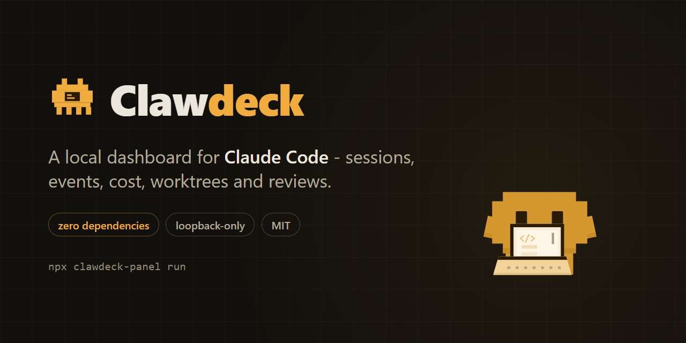
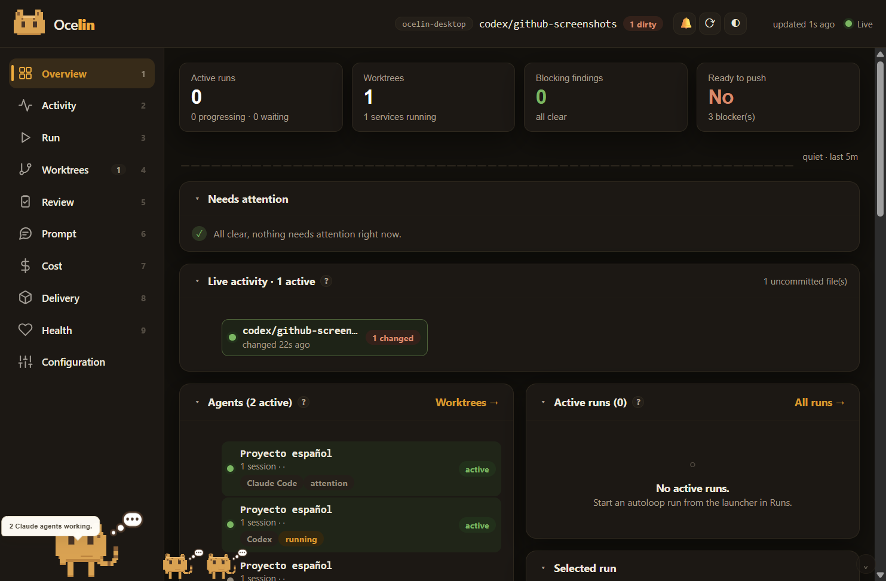

<p align="center">
  
</p>

# Clawdeck

[](https://github.com/m-sanchez/clawdeck/actions/workflows/ci.yml)
[](LICENSE)
[](package.json)
[](package.json)
[](https://github.com/m-sanchez/clawdeck/stargazers)

An **unofficial local dashboard for Claude Code**. Point it at any project you
work on with Claude Code and it shows what is actually happening: live
sessions, an event timeline, cost and context telemetry, git worktrees,
reviews, and delivery state - in one local web UI.



- **Zero dependencies.** Pure Node stdlib on the server, browser-native ES
  modules in the UI. No build step, no `node_modules`.
- **Loopback-only.** Binds `127.0.0.1`, refuses foreign `Host` headers, gates
  privileged routes behind a per-launch bearer token.
- **Degrades gracefully.** Everything works read-only on a bare git repo; more
  signal appears as you opt in to the hooks, statusline bridge, and OTEL.

> Clawdeck is a community project. It is not affiliated with or endorsed by
> Anthropic.

## Quickstart

```bash
npx clawdeck-panel run --checkout /path/to/your/project
```

Or from a clone:

```bash
git clone https://github.com/m-sanchez/clawdeck.git
cd clawdeck
node scripts/panel-run.mjs --checkout /path/to/your/project
```

That alone gives you the git-level views (worktrees, diff, commits, MR draft)
and session liveness from Claude Code's own transcript files.

## Install the integration (optional, recommended)

The event timeline, activity feed, and cost views are fed by a tiny hook +
statusline bridge you install into the observed project:

```bash
npx clawdeck-panel init --target /path/to/your/project --statusline
```

`init` copies the emitter hook (and its lib) into the project's
`.claude/hooks/`, installs `/panel` slash commands, and prints the hook
registrations to paste into `.claude/settings.json` - or merges them for you
with `--write-settings` (only ever appends its own entries; backs up first).
Restart your Claude Code session afterwards.

## What you get at each level

| Setup                   | What lights up                                                    |
| ----------------------- | ----------------------------------------------------------------- |
| bare git repo           | Overview, worktrees, diff/review views, MR draft, session pulse   |
| + event hooks           | live event timeline, per-session activity, delivery lifecycle     |
| + statusline bridge     | live cost, context-window, and model telemetry per session        |
| + OTEL exporter pointed at the panel | token/cost metrics via OTLP-JSON                     |
| + GitHub / GitLab token | MR/PR + pipeline status, merge tracking, notifications            |

## Forge connectors

Clawdeck auto-detects the project's git host from `origin` and speaks to it
read-only:

- **GitHub** (github.com + GHES) - PRs and Actions runs. `GITHUB_TOKEN`
  optional for public repos.
- **GitLab** (gitlab.com + self-hosted) - MRs and pipelines. Needs
  `GITLAB_TOKEN`.
- Roadmap: Bitbucket Cloud, Gitea/Forgejo, Azure DevOps.

Tokens live in the observed project's `.claude/settings.local.json` (or env)
and never reach the browser.

## Roadmap

- More forge connectors (above).
- Time-window tabs (7d / 30d / all-time) on the Cost view, with per-model
  input/output/cache breakdowns.
- Stale-while-revalidate snapshot refresh and dirty-section re-rendering.
- Collapsible dashboard cards persisted per browser.
- Session → subagent hierarchy tree view.
- Host metrics strip (CPU / RAM / disk) with per-metric thresholds.

## Architecture

```
Claude Code hooks ──► durable spool (at-least-once) ──► single-writer store
                                                            │
statusline bridge ──► per-session telemetry records ────────┤
OTLP-JSON exporter ─► OTEL receiver ────────────────────────┤
                                                            ▼
                                             HTTP + SSE server (loopback)
                                                            ▼
                                             browser SPA (no build step)
```

The server never watches the filesystem; it polls adapters per request and on
a bounded SSE interval. See [ARCHITECTURE.md](ARCHITECTURE.md) and
[docs/DECISIONS.md](docs/DECISIONS.md).

## Security model

- Loopback bind + strict `Host` allowlist (anti-DNS-rebinding).
- Per-launch bearer token, delivered to the browser **only in the URL
  fragment** (never in served HTML, API bodies, logs, or Referers).
- Separate per-launch ingest token for the event POST route.
- PID+nonce ownership checks so lifecycle scripts can never kill a reused PID.
- Single-writer lock on the canonical event store; a second panel degrades to
  its own local store instead of corrupting the shared one.
- Deep links to Claude are **fail-closed secret-scanned**: a prompt containing
  suspected secret material refuses to become a URL.
- No shell endpoint. Commands are a fixed allowlist with server-built argv.

Details: [docs/SECURITY.md](docs/SECURITY.md).

## Development

```bash
npm test              # node --test (~300 tests)
npm run self-test     # boots the server against this repo and checks /health
```

## License

[MIT](LICENSE)
