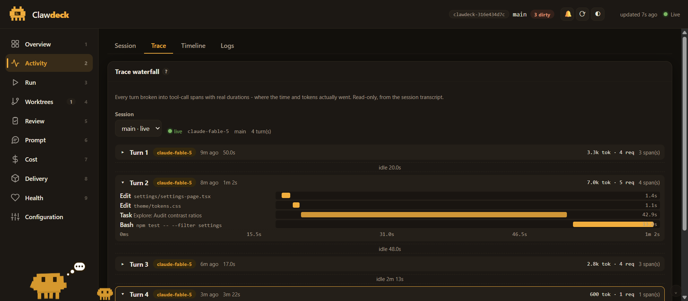
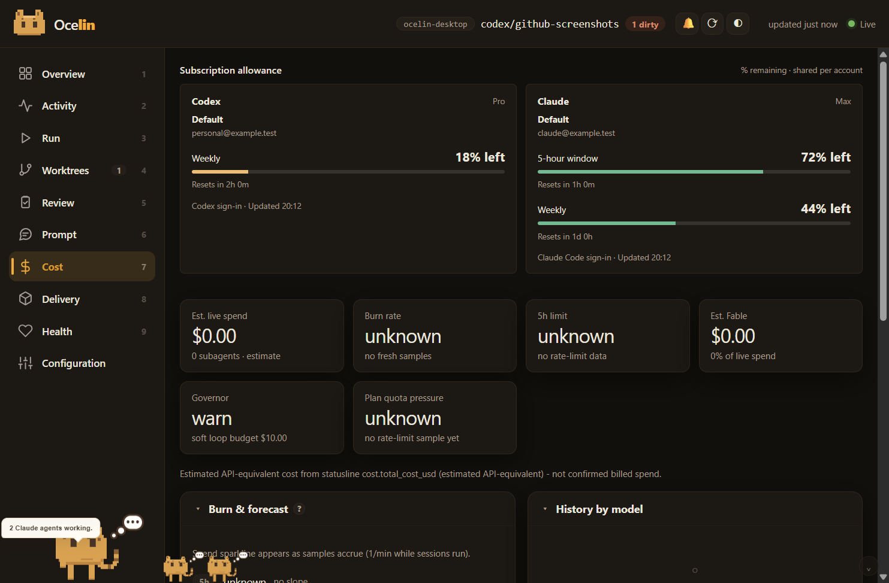

<p align="center">
  
  <br />
  
</p>

# Clawdeck

[](https://github.com/m-sanchez/clawdeck/actions/workflows/ci.yml)
[](LICENSE)
[](https://www.npmjs.com/package/clawdeck-panel)
[](package.json)
[](package.json)
[](https://github.com/m-sanchez/clawdeck/stargazers)

An **unofficial local dashboard for Claude Code**. Point it at any project you
work on with Claude Code and it shows what is actually happening: live
sessions, an event timeline, cost and context telemetry, git worktrees,
reviews, and delivery state - in one local web UI.


## Feature tour

**Git + Claude Workbench** (Delivery hub) - what stands between this branch
and a shipped change, connected to the code and to Claude.

- **Readiness** answers two questions separately, because they are different
  questions: can the REMOTE change merge, and has all the LOCAL work reached
  it. A dirty worktree blocks the second and not the first. Each axis is
  `READY | BLOCKED | UNKNOWN`, and UNKNOWN is a real answer - "I cannot show
  that you can merge" is not "you can merge".
- **Review Inbox** imports the PR/MR discussion read-only, maps each comment to
  the line it now points at (anchor-aware, so a line that moved by eight reads
  as moved, not changed), and derives a state with its evidence attached. Fact,
  derivation and model output are three different visual grammars; every derived
  state has a `Why?` that shows the reasons verbatim.
- **CI** is read for the commit the change is on, never for "the latest run",
  and covers every check context - a green Actions run beside a failing
  external status is `failing`, and an incomplete read is `unknown`, never a
  pass. Failing jobs offer their output (tail only, secret-scanned) and a
  scoped `Fix locally` task.
- **Attention** is what needs a person, kept apart from what blocks delivery:
  an unpushed commit blocks shipping and needs nobody's judgement, so it never
  reaches the badge.
- **Decision ledger** records why the change went the way it did. Claude can
  draft; only a person can decide, and the record says which.

Clawdeck never writes to the forge. There is no reply, resolve, approve or
merge action, no mutation document in the provider layer, and model output can
never move state - only a human action promotes advice into anything.

**Trace waterfall** - every turn of a session broken into tool-call spans
with real durations: subagent tasks, failing commands, and human-wait spans
(dashed, width-capped) at a glance.



**Burn rate & forecast** - $/hour from statusline cost deltas, 5h/7d
depletion slopes with ETA, per-model token history over 7d/30d/all-time
windows. Estimates are labelled as estimates; unknowns stay unknown.



**Ask Clawdeck** (Prompt hub) - ask questions about panel state, answered by
a local `claude -p` child running tool-less in a sterile temp dir; the only
context sent is a compact, secret-scanned snapshot summary.

Also in the box:

- **Config map** (Configuration) - every rule, slash command, skill, agent,
  MCP server, and hook the checkout declares to Claude Code, overlaid with
  what recent sessions actually invoked. Dead config shows up dim.
- **MCP & skills analytics** (Cost) - per-server call counts, error rates,
  and durations from recent transcripts: evidence for whether a server earns
  its context cost.
- **Host vitals** (Health) - CPU, memory, and checkout-volume disk next to
  the panel's own self-performance numbers.
- **Cheap refreshes** - snapshots carry per-section content hashes, so
  unchanged views skip re-rendering, `/api/snapshot` answers 304, and the
  page revalidates when you come back to the tab.

Principles:

- **Zero dependencies.** Pure Node stdlib on the server, browser-native ES
  modules in the UI. No build step, no `node_modules`.
- **Loopback-only.** Binds `127.0.0.1`, refuses foreign `Host` headers, gates
  privileged routes behind a per-launch bearer token.
- **Degrades gracefully.** Everything works read-only on a bare git repo; more
  signal appears as you opt in to the hooks, statusline bridge, and OTEL.

> Clawdeck is a community project. It is not affiliated with or endorsed by
> Anthropic.

## Quickstart

```bash
npx clawdeck-panel run --checkout /path/to/your/project
```

Or from a clone:

```bash
git clone https://github.com/m-sanchez/clawdeck.git
cd clawdeck
node scripts/panel-run.mjs --checkout /path/to/your/project
```

That alone gives you the git-level views (worktrees, diff, commits, MR draft)
and session liveness from Claude Code's own transcript files — zero setup,
nothing written to your project, one loopback server that stops when you
close it.

> **`npx` vs a clone for `init`.** The one-off `run` above is fine over
> `npx`. But `init` (below) writes generated `/panel` slash commands that
> reference the panel's install path — under `npx` that is the npm cache
> directory, which npm may garbage-collect. If you plan to keep the
> integration installed, run `init` from a clone (or a global install) so
> the referenced path is stable.

## Install the integration (optional, recommended)

The event timeline, activity feed, and cost views are fed by a tiny hook +
statusline bridge you install into the observed project:

```bash
npx clawdeck-panel init --target /path/to/your/project --statusline
```

`init` copies the emitter hook (and its lib) into the project's
`.claude/hooks/`, installs `/panel` slash commands, and prints the hook
registrations to paste into `.claude/settings.json` - or merges them for you
with `--write-settings` (only ever appends its own entries; backs up first).
Restart your Claude Code session afterwards.

## What you get at each level

| Setup                   | What lights up                                                    |
| ----------------------- | ----------------------------------------------------------------- |
| bare git repo           | Overview, worktrees, diff/review views, MR draft, session pulse   |
| + event hooks           | live event timeline, per-session activity, delivery lifecycle     |
| + statusline bridge     | live cost, context-window, and model telemetry per session        |
| + OTEL exporter pointed at the panel | token/cost metrics via OTLP-JSON                     |
| + forge token           | MR/PR + pipeline status, merge tracking, notifications            |

To point Claude Code's OTEL exporter at the panel, set these before
launching Claude (the panel prints its port and token on start; the
`/v1/metrics` endpoint requires the panel token):

```bash
export CLAUDE_CODE_ENABLE_TELEMETRY=1
export OTEL_METRICS_EXPORTER=otlp
export OTEL_EXPORTER_OTLP_PROTOCOL=http/json
export OTEL_EXPORTER_OTLP_ENDPOINT=http://127.0.0.1:<panel-port>
export OTEL_EXPORTER_OTLP_HEADERS=x-panel-token=<panel-token>
```

## Forge connectors

Clawdeck auto-detects the project's git host from `origin` and speaks to it
read-only:

- **GitHub** (github.com + GHES) - PRs, review threads, and checks.
  `GITHUB_TOKEN` optional for reading a public repo's status; needed for review
  resolution and job logs. If the `gh` CLI is signed in, Clawdeck uses that
  credential rather than asking you to configure a second one
  (`CLAWDECK_NO_GH_CLI=1` turns that off).
- **GitLab** (gitlab.com + self-hosted) - MRs and pipelines. Needs
  `GITLAB_TOKEN`.
- **Bitbucket Cloud** - PRs and Pipelines. Needs `BITBUCKET_TOKEN` (a
  repository/workspace access token).
- **Azure DevOps** - PRs and builds. Needs `AZURE_DEVOPS_TOKEN` (a PAT).
- **Gitea / Forgejo** - PRs and commit status. Self-hosted hosts are
  anonymous, so opt in with `GITEA_URL` (+ `GITEA_TOKEN` for private repos).

Tokens live in the observed project's `.claude/settings.local.json` (or env),
or come from the signed-in `gh` CLI for GitHub, and never reach the browser.

## Roadmap

- Session → subagent hierarchy tree view.

## Architecture

```
Claude Code hooks ──► durable spool (at-least-once) ──► single-writer store
                                                            │
statusline bridge ──► per-session telemetry records ────────┤
OTLP-JSON exporter ─► OTEL receiver ────────────────────────┤
                                                            ▼
                                             HTTP + SSE server (loopback)
                                                            ▼
                                             browser SPA (no build step)
```

The server never watches the filesystem; it polls adapters per request and on
a bounded SSE interval. See [ARCHITECTURE.md](ARCHITECTURE.md) and
[docs/DECISIONS.md](docs/DECISIONS.md).

## Security model

- Loopback bind + strict `Host` allowlist (anti-DNS-rebinding).
- Per-launch bearer token, delivered to the browser **only in the URL
  fragment** (never in served HTML, API bodies, logs, or Referers).
- Separate per-launch ingest token for the event POST route.
- PID+nonce ownership checks so lifecycle scripts can never kill a reused PID.
- Single-writer lock on the canonical event store; a second panel degrades to
  its own local store instead of corrupting the shared one.
- Deep links to Claude are **fail-closed secret-scanned**: a prompt containing
  suspected secret material refuses to become a URL.
- **The Workbench is read-only against every forge.** REST calls are GETs, the
  one GraphQL POST carries a frozen read-only query document, and no
  reply/resolve/approve/merge action exists to be called.
- **A task brief goes to a file, never a URL.** The deep link carries only the
  task id, that path and a correlation marker, so review text and diffs never
  enter browser or OS history.
- **CI job output is fetched per job, tail-bounded and secret-scanned in both
  directions**: a hit withholds the text, and a scanner that will not load
  withholds it too.
- No shell endpoint. Commands are a fixed allowlist with server-built argv.

Details: [docs/SECURITY.md](docs/SECURITY.md).

## Development

```bash
npm test              # node --test
npm run self-test     # boots the server against this repo and checks /health
```

## License

[MIT](LICENSE)
