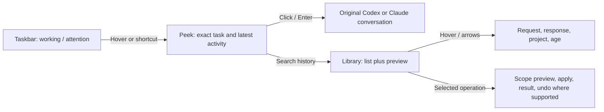
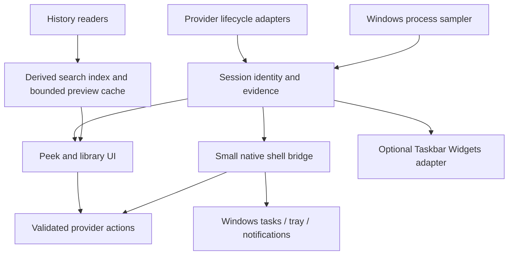

# Ocelin: native integration and session management

Research date: 17 September 2026. This replaces the product recommendations in the September 16 desktop research. It does not describe a completed release.

**Recommendation: make Ocelin a Windows companion for finding, inspecting, returning to, and tidying agent sessions.** Prove those actions in the actual provider apps and Windows shell before expanding the dashboard. Keep Ocelin's approved identity, the ocelot, official provider icons, and the existing collector where useful.

## Why 0.5 does not meet the brief

The implementation delivered surfaces and monitoring, but the most important actions still break the workflow:

| User intention | Current implementation | Required behavior |
| --- | --- | --- |
| See progress inside the taskbar | Built-in tile sits above it; exported widget has not been exercised in Explorer | Real shell integration, visibly demonstrated on supported Windows builds |
| Return to a conversation | `openSession` dispatches `project`; main creates an Ocelin project window | Open the exact conversation in its owning application |
| Understand an old session immediately | Tooltip is title and ID; details menu is metadata | Hover/focus preview of the actual request, last useful response, project and age |
| Tidy old sessions | `historySince` hides older rows | Separate local organization, native archive and storage deletion, each with correct scope |
| Know whether an agent needs attention | Transcript inference is the installed configuration observed during this audit | Verified lifecycle connection, attention reason and freshness; unknown stays unknown |
| Find a task whose folder disappeared | Project navigation requires an existing directory | History remains readable independently of the working directory |
| Understand RAM use | Provider process totals exist, but session and process concepts are disconnected | App totals and attributable processes; shared memory stays shared |

Source evidence: [session click](../desktop/renderer/app.mjs), [project navigation](../desktop/main.cjs), [history filter](../desktop/renderer/session-model.mjs), [hook installer](../server/monitor/integrations.mjs), [collector](../server/monitor/collector.mjs). The collector's recent-file cap and retention suit a monitor, not a complete historical library. Persisted last-known execution state is not proof that an old task is currently running.

The read-only audit found no Ocelin-owned entries in the provider user hook files, no Ocelin hook ownership records, and no recorded hook receipt in the monitor checkpoint. All saved session evidence was inferred. Project/plugin hooks were not exhaustively enumerated. The app should expose this connection gap directly.

## What is actually possible in Windows

The previous comparison missed a relevant public API. Microsoft's April update notes describe third-party agents on the taskbar. Current documentation exposes `Windows.UI.Shell.Tasks`, still with experimental/prerelease annotations and rollout qualifications. This is a documented route worth prototyping, not a universal compatibility guarantee. [Microsoft release notes](https://support.microsoft.com/en-us/servicing/os/windows-11/2026/04/april-30-2026-kb5083631-os-builds-26200-8328-and-26100-8328-preview), [API namespace](https://learn.microsoft.com/en-us/uwp/api/windows.ui.shell.tasks?view=winrt-28000).

| Route | What it delivers | Evidence and decision |
| --- | --- | --- |
| **Windows app tasks** | Real shell task representations with status, progress content and activation | First prototype. On the audited Windows 11 25H2 build 26200.9457, type presence and `AppTaskInfo.IsSupported()` both returned true. Visible behavior remains untested. |
| **Compact text inside the taskbar** | Persistent counts/RAM strip alongside shell controls | Keep selectable through Taskbar Widgets. It changes Explorer's private XAML tree; validate the installed host and recovery, not only our package schema. |
| Standard taskbar button and tray | Attention badge, tooltip, jump targets and notification-area entry | Supported fallback. Does not provide an arbitrary weather-like text slot. |
| Windows Widgets board | Adaptive-card content in the Widgets experience | Optional later. A board widget does not establish control of a persistent custom weather slot. |
| Floating / screen-edge bar | Independent window, optionally reserving screen space | Preserve as an option; off by default in the proposed taskbar-first setup. |

The two taskbar choices serve different preferences. Native cards follow Windows presentation rules. A persistent custom numeric strip needs the optional private integration. Do not substitute one for the other without explaining the difference. [Widgets platform](https://learn.microsoft.com/en-us/windows/apps/develop/widgets/), [existing taskbar APIs](https://www.electronjs.org/docs/latest/tutorial/windows-taskbar).

### Native prototype contract

`AppTaskInfo` requires package identity and the `com.microsoft.apptaskprovider` manifest extension. It supports enumeration, update and removal; tasks can survive app restarts and reboots. Consult its support check at runtime. [AppTaskInfo](https://learn.microsoft.com/en-us/uwp/api/windows.ui.shell.tasks.apptaskinfo?view=winrt-28000).

Content can represent steps, result text or a thumbnail. States include Running, Completed, NeedsAttention, Paused and Error. Use visible tool/activity descriptions, never private reasoning or invented completion percentages. [Content](https://learn.microsoft.com/en-us/uwp/api/windows.ui.shell.tasks.apptaskcontent?view=winrt-28000), [states](https://learn.microsoft.com/en-us/uwp/api/windows.ui.shell.tasks.apptaskstate?view=winrt-28000).

1. Package a small native companion with an Ocelin activation protocol; start with a disposable synthetic task.
2. Create, update, hover, activate and remove a real taskbar task. Record what Windows renders.
3. Test grouping: the API says task title participates in grouping. Verify before choosing one item per task or per project. Never export the whole history to the taskbar. [Creation contract](https://learn.microsoft.com/en-us/uwp/api/windows.ui.shell.tasks.apptaskinfo.create?view=winrt-28000).
4. Activation resolves an opaque Ocelin session reference locally and dispatches an allowlisted native action. No arbitrary URLs or shell commands in activation payloads.
5. Reconcile persisted tasks at startup; respect user-hidden tasks and remove obsolete entries without repeatedly recreating them.
6. Exercise attention, completion, sleep, Explorer restart and uninstall, with a verified fallback.

A helper can coexist with Electron. Full MSIX and an identity package with external location are candidates; the latter can preserve an existing installer. The prototype must establish which package arrangement supports this extension. Include signing and upgrade/uninstall behavior. Windows APIs do not by themselves require a full UI rewrite. [Package identity](https://learn.microsoft.com/en-us/windows/apps/desktop/modernize/modernize-packaged-apps), [external-location packaging](https://learn.microsoft.com/en-us/windows/apps/desktop/modernize/grant-identity-to-nonpackaged-apps).

## Provider integration: separate capabilities, explicit proof

Separate **observe live state, read history, open exact native session, and manage lifecycle**. A green provider icon must not imply all four work.

| Capability | Codex | Claude Code / Desktop Code |
| --- | --- | --- |
| History list and preview | App-server list/read and paginated turns succeeded locally | Official SDK exposes session enumeration and message reads; existing transcript adapters remain a zero-dependency option |
| Live externally started work | Version-tested hooks; a separate server does not establish attachment to Desktop's runtime | Shared CLI/Desktop hook configuration is documented; verify delivery from each host |
| Exact Desktop navigation | Installed package registers `codex`; inspected handler parses `codex://threads/<id>`. Source evidence only in this audit | Earlier personal-helper disposable test used `claude://resume?session=<uuid>`. Version-specific evidence, not a universal public link contract |
| CLI continuation | Explicit ID and verified cwd; different from focusing an existing terminal | `claude --resume <id>` documented; `/desktop` is the official CLI-to-Desktop flow |
| Native archive / restore | API and installed schema expose archive/unarchive; validate descendants, active tasks and Desktop refresh | General Desktop archive API not established. Do not substitute private descriptor edits |
| Permanent deletion | Current protocol/schema include `thread/delete`, with descendant scope; not exercised | CLI has project-wide purge with dry-run, broader than deleting one conversation. Fine-grained Desktop API not established |

Codex's stored history and loaded runtime are distinct. The local probe listed ten tasks, read metadata and returned two recent turns; its independent runtime had zero loaded tasks. Generated schema describes `useStateDbOnly`, avoiding list's scan-and-repair path. The installed daemon command rejected Windows; it cannot be assumed to provide a shared Desktop connection here. [Codex app-server](https://learn.chatgpt.com/docs/app-server), [probe record](../research/windows-integration-2026-09-17/capabilities.json).

Claude's SDK history functions support a picker without starting a model turn. Resuming preserves conversation context, but history does not restore missing worktrees. Shared configuration does not make all app surfaces' histories and lifecycle semantics identical. [SDK sessions](https://code.claude.com/docs/en/agent-sdk/sessions), [Desktop integration](https://code.claude.com/docs/en/desktop), [CLI sessions](https://code.claude.com/docs/en/sessions).

Prefer lifecycle events over transcript timestamps. Preserve other hooks, install only owned entries, and verify receipt from a real session. Configuration written does not mean integration connected. [Codex hooks](https://learn.chatgpt.com/docs/hooks), [Claude hooks](https://code.claude.com/docs/en/hooks).

Native navigation must prove:

- Warm and cold apps reach the correct conversation, including duplicate titles.
- Archived-session reopening has explicit restore semantics where the provider restores automatically.
- Missing source, wrong account, missing project and unsupported version produce an informative result.
- Opening a running task creates neither a second writer nor a submitted prompt.
- CLI fallback says “Resume in terminal,” rather than claiming successful Desktop navigation.
- Codex's in-app task tools are not assumed to be an API redistributable with Ocelin.

## Useful products and lessons from their code

Nine additional repositories were pinned and 39 source/document/license files downloaded, supplementing the earlier collection. Selected implementation paths were inspected; upstream applications were not installed or benchmarked. The [source register](../research/windows-integration-2026-09-17/README.md) records immutable revisions and reuse decisions.

| Reference | Pattern to adopt | Boundary found |
| --- | --- | --- |
| [Maestro](https://github.com/RunMaestro/Maestro/tree/290253d288b5d4f89ecddc658259f2624871790c) | Session browser, title/content search, details and quick resume with lazy history | Owns its live tabs; does not prove focus of existing native provider tabs. AGPL-3.0, interaction reference only |
| [cmux](https://github.com/manaflow-ai/cmux/tree/3773d55f41fa0f8fb2f6c8e588e4cc7862cb099b) | Attention tied to an exact surface; verify saved resume identity before dispatch | Native macOS terminal, not Windows integration. Current GPL-3.0-or-later source stays out of Ocelin |
| [ccmux, epilande](https://github.com/epilande/ccmux/tree/75b7fd3743c5bf4f3915df4f60c83f161ab8842b) | On-demand transcript search and stale-notification action checks | Borrow action identity/expiry, not generic approve-by-keystroke into terminals. MIT |
| [sessions-search](https://github.com/luckeyfaraday/sessions-search/tree/0005a9e516fc855da6a425af09dcffb30ad82453) | Rebuildable FTS5 index, ranked snippets, incremental fingerprints | Replaces indexed messages of a changed session; large growing transcripts need more bounded handling. MIT |
| [agentic-session-explorer](https://github.com/junxit/agentic-session-explorer/tree/f88f5637840e494de7d7728b279d767cdac11913) | Operation preview, affected artifacts, operation log, cautious unknown liveness | Recent file activity alone cannot establish safe native deletion. Prefer lifecycle APIs and locks. MIT |
| [CCManager](https://github.com/kbwo/ccmanager/tree/2e50f4cad1d578e24580da61ff324db4befc8ba1) | Durable ownership/launch context and protection against duplicate restoration | Restoring a launch command is not restoring conversation history. MIT |
| [Taskbar Widgets](https://github.com/pfcdev/TaskbarWidgets/tree/c49721cc1cfcdd53d6ad42226410148153c38055) | Isolated providers, atomic snapshots, small Explorer boundary, recovery | Private XAML diagnostics/tree mutation; appropriate for optional text-strip mode. MIT |
| [TrafficMonitor](https://github.com/zhongyang219/TrafficMonitor/tree/188b8773b959733bfc0e4f506c762d9a255883d4) | Geometry handling for alignment, tray, widgets and secondary screens | Shows build-specific maintenance cost. Current root license is Anti-996, not MIT |
| [Windhawk taskbar AI usage](https://github.com/ovenmakemeheat/windhawk-taskbar-ai-usage/tree/11e5256963557968022ac17b5b8fc1535d7e3acd) | Compact provider composition | Code creates a transparent nonactivating popup overlay. README admits heuristic status and cost-derived percentages, not server quota. File-level MIT marker; no root license found |

The earlier [CodexMonitor, Claude Deck, AgentBar and usage-monitor source pack](../research/windows-desktop-2026-09-16/README.md) remains useful for collector/window mechanics. The priority changes: session actions and native integration now determine architecture, rather than the convenience of wrapping the dashboard.

## One product, three depths

These answer different questions; they are not three compulsory windows repeating the same cards.

| Depth | Question | Proposed interaction |
| --- | --- | --- |
| **Glance** | Is anything running or waiting for me? | Native taskbar status, or selectable strip such as `2 working · 1 needs you · 2.2 GB`. No historical count |
| **Peek** | Which task, what is happening, what does it need? | Windows hover card or Ocelin flyout; attention first, then running work, grouped by project. Hover/focus a row to preview |
| **Library** | What was that old task, and should I keep it? | Searchable list with persistent preview pane, filters, multi-select and cleanup. Project analytics are secondary |

Interaction specifications:

- Preview the request, latest meaningful assistant response, visible tool action, project/branch, provider and age. Use plain text or sanitized Markdown; no raw HTML entities or injected transcript HTML.
- Proposed intentional-hover delay: 250 ms. Keyboard focus provides the same preview; moving into it keeps it open; Escape dismisses. Hover never launches, resumes or restores.
- Library arrow keys update the preview pane; Enter or the visible Open button opens the native task. Space selects for bulk actions when list focus is active.
- Debounce search, cancel stale reads, bound parsing and cache small previews. Start with lexical search over title, project and human/assistant messages. No background LLM summaries or embedding service required.
- Now, History and Archived views; filters for provider, project, age, saved transcript and missing workspace. Preserve selection and scroll during updates.
- Unvisited completed work remains reviewable, distinct from permission requests. One notification owner deduplicates across taskbar, tray and flyout.
- Configurable shortcut for Peek and next task needing attention; detect conflicts and respect foreground restrictions.
- Ocelot small and optional in dense surfaces. Official provider marks identify ownership; text and shapes identify state. Motion never substitutes for information.

First run should show each provider's installation, readable history and verified live connection separately. Setup previews owned hook changes, preserves configuration, explains provider trust/restart steps and waits for an actual event. Diagnostics show last successful read/event and installed version. Users should not need to understand transcript inference to notice that integration was never enabled.

## Cleanup with honest scope

Old transcript files consume disk; they do not imply a process consuming RAM. Closing an application, archiving a conversation and deleting history are different operations.

| Action label | Scope | Reversibility / storage effect |
| --- | --- | --- |
| Hide in Ocelin | Local organization | Undo; no native change or transcript storage savings |
| Archive in Codex / Claude | Provider conversation, only through a verified adapter | Provider restore where supported; no disk-saving promise |
| Delete saved recovery copy | Selected recovery-library objects | Separate from originals; preview exclusive bytes, not shared database totals |
| Delete native session | Provider lifecycle, including any descendant scope | Exact affected-task preview; permanent unless separately exported; unavailable when unsupported |
| Purge project history | Whole provider project | Separate advanced action; enumerate all categories; never use for one row |
| Remove Ocelin cache | Owned index/thumbnails | Rebuildable; native conversations untouched |

Flow: select a cohort such as older than 90 days, inspect without opening, exclude pinned/live/uncertain sessions, choose an operation, preview exact scope, apply, and show per-item results. Missing folders remain previewable. Missing transcripts are explicitly unavailable.

Bind plans to IDs, source versions and action type. Recheck liveness and scope at execution; keep changed sessions and explain why. Journal partial success. Show Undo only where a real inverse operation exists. Do not call archive disk cleanup or call the current visibility filter deletion.

Shared recovery-library cleanup is a separate optional adapter. Its catalog state, original stores and snapshots are different inventories. Never sum their counts into running sessions. The private Session Doctor audit informed this design; user titles, IDs and transcripts are omitted from this report.

## Architecture decision

**Start with a narrow native bridge and reuse the collector. Benchmark before replacing the desktop host.**

One collector feeds all surfaces. Always-on work is separate from heavy project views. Identity includes provider, source installation/account scope and native ID; map Desktop/CLI aliases explicitly. Directory and title alone never establish identity.

The action broker exposes `canPreview`, `canOpenNative`, `canArchive`, `canRestore` and `canDelete`, with evidence/version coverage. No arbitrary shell endpoint. Hooks stay short, local and metadata-only. History readers load transcripts on demand. The native bridge owns activation and shell-task reconciliation.

A derived FTS5 index is a candidate. An in-memory probe confirmed FTS5 in local Node 24.9 built-in SQLite; packaged Electron needs its own check. Preserve standalone Node 20 compatibility and zero runtime dependencies. Desktop search must not silently raise the core runtime floor. Index useful conversation text with retention limits and retain source references for full previews.

Compare existing Electron plus native bridge against a small native resident host that opens the web library lazily, using the same fixtures and complete process-tree measurements. Choose the latter only if idle footprint materially improves without worsening compatibility and updates. A framework rewrite is not proof of efficiency.

Keep measured app RAM totals and process descendants. Assign processes to sessions only with established ownership; shared Desktop infrastructure remains shared. Memory and storage have separate controls. Avoid force-killing an entire provider from one session row.

## Delivery order and acceptance gates

Proposed work packages, not completion claims. Resolve feasibility before scheduling the larger UI implementation.

| Order | Deliverable | Pass condition |
| --- | --- | --- |
| **1. Native proof** | Packaged Windows task, exact Codex/Claude navigation, real hook receipt | Windows recording shows running → attention → completed, hover, exact-session open and removal; warm/cold navigation; no duplicate session or submitted prompt |
| **2. Usable history** | Full library, indexed search, hover/focus preview, missing-cwd handling | Find known task among 10,000 fixtures; inspect without clicking; open exact conversation in one action; verify message coverage |
| **3. Lifecycle management** | Codex archive/restore first; capability-specific Claude options; bulk plans | Disposable sessions archive/restore with transcript hashes preserved; descendant scope and partial failures accounted for; live/uncertain tasks excluded |
| **4. Windows experience** | Both taskbar styles, tray fallback, notifications, shortcut, startup/recovery | Actual Explorer-host widget test; independent native-mode test; sleep/lock/restart/monitor/DPI matrix; no forced focus or duplicate alerts |
| **5. Performance and release** | Host decision, accessibility, installer migration, accurate GitHub/site | Sustained resource budgets, keyboard/screen-reader checks, upgrade/uninstall preservation and recorded proof for advertised features |

Proposed targets to measure, not advertise now:

- Cached Peek paint p95 below 150 ms after hover delay; typical uncached indexed preview below 500 ms.
- Search p95 below 200 ms on fixed 10,000-session fixture, excluding initial indexing.
- Event visible within one second after receipt; no full-history idle rescans.
- Resident process-tree private working set goal at or below 150 MiB with library closed; measure open UI separately. Compare native host if current host cannot meet this.
- Whole-machine average idle CPU below 0.5% over 30 minutes; report hardware, method and all helper processes.
- Hook capture p95 below 50 ms; compare a small helper with the current PowerShell-plus-Electron launch path.

Correctness matrix: duplicate titles, account changes, multiple tasks/project, archived/running tasks, legacy/paginated histories, missing cwd/transcript, malformed/large files, interrupted tools, lost hooks, offline sources, out-of-order events, provider updates, partial lifecycle failures and crash recovery. UI matrix: keyboard, Narrator, high contrast, reduced motion, light/dark, 100/150/200% scaling, mixed monitors, taskbar alignment/auto-hide and overflow.

Existing core self-test and unit tests remain mandatory for implementation changes. Packaging tests do not replace native acceptance checks. Update GitHub and website claims after these demonstrations pass.

## Evidence and uncertainties

- **Locally proven:** Windows API availability; Codex read-only listing, metadata and recent turn pagination; installed protocol schema; local FTS5; current navigation/filter/hook-setup gaps.
- **Source inspected:** Windows API/packaging contracts, native Codex URI handler, selected competitor paths at pinned commits.
- **Earlier evidence, not retested here:** Claude resume URI in the personal Session Sync disposable-task investigation. Current account/restore side effects still need tests.
- **Prototype required:** actual shell rendering/grouping, package form, both native links end to end, cross-process live ownership, lifecycle reflection in Desktop UI and Explorer text-strip behavior.
- **Not established:** general third-party Claude Desktop archive/delete API, universal terminal-tab focus, per-session RAM inside shared Desktop processes, or control of arbitrary existing work through a second app-server.

Validation of this research change: reference hashes and local document links passed; the package self-test passed on an isolated rerun after its first startup timed out during parallel validation. `npm test` finished with 675 passes and one existing environment-sensitive failure in `review-inbox-assist.test.mjs:120`, reproduced independently. That assertion rejects every token-shaped environment name, while `askChildEnv()` intentionally permits the Claude CLI's own OAuth credential; another existing test explicitly requires that exception. Production and test code were not changed for this research. No credential value was logged.

The next deliverable should be stage 1's native proof. A more attractive dashboard alone would leave the core complaint unresolved.
