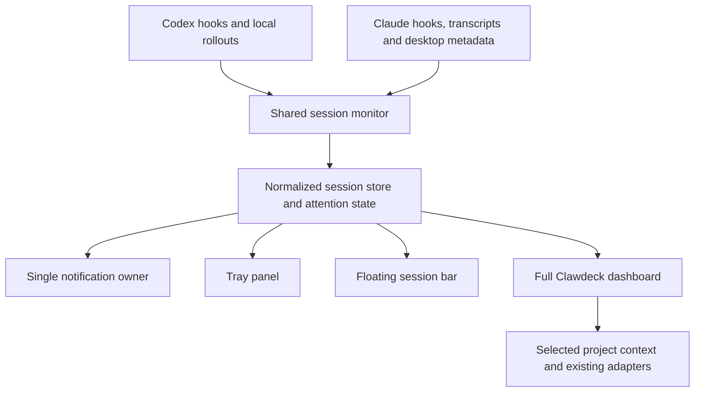

# Clawdeck on Windows: research and delivery plan

Research date: 16 September 2026. Status: proposal, not an implemented desktop release.

The requested product is a Windows companion for existing Codex and Claude coding sessions, with **tray panel, floating session bar, and full desktop dashboard independently selectable**. A user can enable one, two, or all three. They share a session catalog, attention state, preferences, and notification owner.

## Recommendation

Build **Clawdeck Desktop** as an optional Electron package around the existing Node server and browser-native UI. Add a provider-neutral, cross-project session monitor first. Start with supported Windows tray and window APIs; offer a floating bar that can sit immediately above the taskbar. Treat a screen-edge bar that reserves space as a later option. Keep literal embedding inside Explorer's taskbar experimental.

This is an implementation-fit judgment: the repository already uses JavaScript, Node built-ins, HTTP, SSE, and browser ESM. Electron can host that work with comparatively little translation. It does add a desktop runtime and its maintenance obligations. Keep those dependencies in `desktop/`, leaving the standalone server and UI dependency-free.

Tauri is the strongest alternative if measurements show Electron's background footprint is unacceptable. It supports tray windows and bundled sidecars, but retaining this backend means packaging Node alongside a Rust host. A native .NET/WebView2 host is also feasible, particularly for a Windows-only product. Neither alternative removes the session-model work.

The most valuable feature is an accurate answer to **“Which task needs me now?”** A wrapper displaying the existing dashboard alone would not deliver that.

## Research scope and evidence

Reviewed first-party project READMEs, selected implementation files, official provider documentation, Windows APIs, and Clawdeck's current source. The comparison below contains **12 relevant projects**, including two unrelated products called AgentBar. Repository descriptions establish advertised behavior, not successful testing on this machine. No competitor was installed, executed, or benchmarked during this research. Recommendations and effort estimates are engineering judgments.

### Existing products and ideas worth adapting

| Project | What the source establishes | Idea for Clawdeck | Limitation or difference |
| --- | --- | --- | --- |
| [ClaudeDeck, hydropix](https://github.com/hydropix/claude-deck) | Windows PowerShell tray monitor with a larger always-on-top overview, hook-fed Claude session states, project colors, focus actions, and completion acknowledgement. | Attention-first ordering; a persistent unread completion marker; stable project initials; compact and expanded views. | Claude-focused. Window targeting must be verified for each host application. This is a different project from Clawdeck. |
| [AgentBar for Windows, michalstrnadel](https://github.com/michalstrnadel/AgentBar-Windows) | Native .NET tray counterpart with per-session state files, provider identities, hooks, and approval UI. Its README explicitly describes a prerelease that has not been built or tested on real Windows. | One tray icon summarizing the most urgent session; small provider adapters; local event transport. | Useful design reference, not a validated dependency. Its Codex integration uses completion notifications; its claim that Codex lacks richer hooks is behind current official documentation. Do not adopt its keystroke-based approvals. |
| [AgentBar for macOS, michalstrnadel](https://github.com/michalstrnadel/AgentBar) | Offers menu bar, Dynamic Island, or both, using a shared local hook protocol. | Independent surface toggles without restarting; a compact summary that expands to session detail. | macOS presentation and permissions cannot simply be ported to Windows. |
| [CodexBar, steipete](https://github.com/steipete/CodexBar) | macOS menu-bar monitor for coding-provider usage limits and reset windows, including merged provider icons. | Clear provider separation; compact reset information; optional combined icon. | Quota monitoring is different from live task state. Keep quota in a secondary view and label unavailable values honestly. |
| [AgentBar, racase](https://github.com/racase/agentbar) | Windows React/Electron tray popover with Codex local usage and Claude token activity, plus a web-session reconnect flow. Other listed providers include placeholders. | A practical example of a compact Windows Electron popover and light/dark presentation. | Does not establish reliable live lifecycle monitoring. Clawdeck need not adopt React or web-cookie authentication. |
| [Codex Usage, upstream-ray](https://github.com/upstream-ray/codex-usage-monitor) | Rust Windows usage widget, taskbar placement, provider rows, configurable alerts, portable and installed distribution. Source parents its window into Explorer's taskbar and implements restart recovery. | Compact horizontal rows; movable placement; deduplicated alerts; portable preview builds. | Tracks quota. Its Explorer embedding increases coupling to the shell; its credential-based usage fetching is unnecessary for local session status. [Embedding source](https://github.com/upstream-ray/codex-usage-monitor/blob/main/src/native_interop.rs), [recovery source](https://github.com/upstream-ray/codex-usage-monitor/blob/main/src/window.rs). |
| [CodexMonitor, Dimillian](https://github.com/Dimillian/CodexMonitor) | Tauri workspace application using a Codex app-server per workspace, with unread/running indicators. Windows builds use a separate configuration. Its README says discovered CLI sessions are not live-streamed unless resumed. | Project grouping; unread markers; detailed conversation access; explicit distinction between discovered and managed sessions. | An orchestrator that owns sessions, whereas this proposal observes work already running in other apps. Do not resume tasks just to monitor them. |
| [Superset](https://github.com/superset-sh/superset/blob/main/apps/docs/content/docs/agent-status.mdx) | Activity strips, lifecycle hooks, waiting/completion notifications, unread badges, and a manual clear-status action. Its documented hooks are scoped to Superset-launched terminals. | Compact per-project activity; clear attention reasons; recovery from stale indicators. | Status coverage is tied to its terminal environment. Clawdeck's intended scope includes externally launched sessions. |
| [Agent Deck, asheshgoplani](https://github.com/asheshgoplani/agent-deck) | Terminal session manager with running/waiting/idle/error states, groups, and a tmux notification bar with direct navigation. Windows support is through WSL. | Keyboard access to waiting sessions; concise states; grouped session navigation. | A terminal/workspace manager rather than a native Windows companion. |
| [Vibe Kanban](https://github.com/BloopAI/vibe-kanban) | Multi-agent workspaces, task planning, diff review, and execution. Its current README carries a sunsetting announcement. | Separate active execution from review-ready work; show what is awaiting a human decision. | Do not make a sunsetting project a foundational dependency. A full task planner would expand this request substantially. |
| [Zebar](https://github.com/glzr-io/zebar) | Configurable desktop widgets built from web content and reactive system-data providers, with widget packs and startup options. | Small rendering surfaces backed by shared providers; monitor-aware placement; an eventual integration for users already running Zebar. | A general widget host would add another required application. Keep an optional integration separate from the default product. |
| [YASB](https://github.com/amnweb/yasb) | Configurable Windows status bar with many widgets, including Claude usage. Configuration includes AppBar behavior, fullscreen hiding, and auto-hide. | Edge docking; per-monitor placement; fullscreen suppression; optional exported status for existing bars. | A complete desktop status bar is broader than the desired coding-session companion. [Configuration](https://github.com/amnweb/yasb/blob/main/docs/Configuration.md). |

Use these interaction patterns as inspiration and implement them in Clawdeck's visual language. If any implementation code is later reused, record its exact revision, license, and attribution requirements first. No third-party code or assets have been copied into the application by this research.

### What the comparison suggests

The useful combination is ClaudeDeck's attention and completion handling, AgentBar's selectable surfaces, Superset's compact activity display, and Agent Deck's fast navigation. Clawdeck already supplies the deeper dashboard these small monitors generally lack.

There are also clear traps: quota dashboards advertised as session monitors, process existence presented as active work, completion-only integrations presented as full lifecycle coverage, and exact-tab focus promised without a supported host integration. The implementation must expose capability differences rather than hide them.

## What “Windows level” should mean

| Surface | Proposed behavior | Windows implementation and caveat |
| --- | --- | --- |
| System tray | One persistent icon, aggregate counts in its tooltip, left-click session panel, right-click settings and quit. | Standard notification-area icon. Windows/user settings control whether it sits in the overflow area; do not promise forced permanent visibility. |
| Floating session bar | Horizontal task chips, draggable, optional always-on-top, snap near a screen edge, selectable monitor, compact/expanded density. | A normal frameless top-level window. Position relative to the display's usable area and taskbar, not hardcoded pixels. |
| Full desktop window | Existing Clawdeck views with a global session list and project selector. | Reuse the browser UI in a desktop window; load heavy project views on demand. |
| Clawdeck taskbar button | Persistent attention overlay and optional activity indicator while the dashboard has a taskbar button. | Supported taskbar APIs operate on our application's window. They do not create an arbitrary text strip inside Explorer. [Electron taskbar APIs](https://www.electronjs.org/docs/latest/tutorial/windows-taskbar). |
| Reserved screen-edge bar | Optional mode where maximized windows leave room for Clawdeck. | Windows AppBar registration supports a separate edge-anchored toolbar and reserved desktop area. Requires native integration and monitor/auto-hide testing. [Microsoft AppBar documentation](https://learn.microsoft.com/en-us/windows/win32/shell/application-desktop-toolbars). |
| Embedded Explorer strip | Potential experimental setting after the standard surfaces work. | The inspected Codex Usage implementation uses Explorer window classes and `SetParent`. That is materially different from a documented session-widget extension point. Keep a fallback floating bar. |

Run as a **per-user application starting at sign-in**, with a user-controlled startup setting. A machine-wide Windows service is a poor fit for interactive tray UI and per-user agent stores because Windows services run in session 0. [Microsoft interactive services](https://learn.microsoft.com/en-us/windows/win32/services/interactive-services).

Microsoft has also announced agent activity on the taskbar and documents Agent Launchers. The current launcher documentation establishes discovery and invocation through App Actions; it does not establish a general API that lets Clawdeck enumerate arbitrary Codex/Claude sessions or publish this entire proposed strip. Treat this as a future compatibility investigation, not a release dependency. [Agent Launchers](https://learn.microsoft.com/en-us/windows/ai/agent-launchers/), [taskbar preview announcement](https://blogs.windows.com/windows-insider/2025/12/19/announcing-windows-11-insider-preview-build-26220-7522-dev-beta-channels/).

## Product behavior

### Three independent choices

Settings → Appearance should contain “Show tray icon,” “Show floating session bar,” and “Open full dashboard.” Remember choices and window placement. Closing a window hides that surface; an explicit Quit Clawdeck command ends monitoring. Prevent a configuration with no visible surface and no working way to reopen the app.

Default recommendation: tray enabled, floating bar offered during onboarding, dashboard opened when requested. Start at sign-in is a visible user preference. All three surfaces can remain enabled simultaneously. Changing a preference must not launch another monitor or repeat a notification.

### Information hierarchy

Each session shows provider, project, task title or safe fallback, state, last activity age, and an attention reason when available. Use project names plus short path/branch details to disambiguate repeated names. Group subagents beneath the parent by default so ten workers do not bury the task needing approval.

Order groups as: needs input; failures needing review; unacknowledged completions; running; idle/recent; stale or disconnected. Keep order stable within a group, and do not reorder under the pointer while a user is choosing a task. Pinned sessions stay discoverable without overriding urgent indicators.

Separate three concepts:

- **Execution:** starting, working, compacting, idle, interrupted, stopped, unknown.
- **Attention:** approval, question, review, error, or none.
- **Result acknowledgement:** unseen completion versus seen completion.

“Finished” means the observed turn ended. It does not prove the user's entire goal is complete. Viewing a completion can mark it seen; viewing an approval cannot resolve that approval. A single failing shell command also does not prove the whole task failed.

Use text and icons together. Status cannot depend on color alone. Preserve the canonical Clawd reference as the visual baseline. The [brand and motion brief](BRAND-AND-MOTION-BRIEF.md) defines the requested evolution into a related, provider-neutral mascot, including all existing state animations, overlap protections, and reduced-motion behavior. Mascot motion should be an optional expression of state, with a quiet text-only density available.

### Notifications and returning to work

Notify once per meaningful transition to attention or completion; persist deduplication across monitor restarts. Let users mute by project/provider, mute completion notifications, or disable sounds. Respect Windows notification settings; provide a local quiet mode and a fullscreen suppression option. Avoid stealing focus.

Clicking a task should open its detail and offer “Return to Codex/Claude.” Use a verified native session link or recorded host mapping when supported; otherwise open the correct application/project and explain the limitation. Exact terminal-tab activation is a separate capability from focusing its parent window. Windows restricts foreground activation, so success cannot be unconditional. [SetForegroundWindow](https://learn.microsoft.com/en-us/windows/win32/api/winuser/nf-winuser-setforegroundwindow).

Version one should direct approval actions to their owning application. Global approval through simulated Enter/Y keystrokes can answer the wrong prompt. A future approval relay needs a documented provider protocol, exact request identity, expiry, and explicit user action.

Usage and limits remain secondary: local tokens, account quota, monetary cost, and task progress are different quantities. Show unknown when the source cannot establish a value. Never infer a completion percentage from elapsed time.

## Reliable Codex and Claude detection

### Current provider interfaces

Official Codex documentation now describes lifecycle hooks including prompt submission, tools, permission requests, stopping, interruption, and session/subagent lifecycle. It supports background command hooks and a Windows command override. The transcript format is explicitly not a stable hook interface. Prefer a version-tested hook adapter, retain tolerant transcript fallback, and verify desktop/CLI coverage rather than assume every installed host exposes the same events. [Official OpenAI hooks documentation](https://learn.chatgpt.com/docs/hooks).

Codex app-server supplies runtime thread status, including waiting-for-approval flags, and lists threads loaded in its own runtime. Its documented event flow follows starting/resuming and subscribing to threads. This does not establish that launching a second server gives access to the live state of the user's separate desktop instance. Use app-server only for a supported shared connection or sessions Clawdeck explicitly owns in a future feature. [Official app-server documentation](https://learn.chatgpt.com/docs/app-server).

Claude Code documents lifecycle hooks and notification types for permission prompts, idle prompts, and elicitation. Use permission and user-input signals separately from completion; apply event-specific behavior. Observation hooks should emit metadata and exit successfully without approval decisions or injected conversation text. [Claude hooks reference](https://code.claude.com/docs/en/hooks), [notification examples](https://code.claude.com/docs/en/hooks-guide).

### Coverage to establish before promising support

| Source | Planned support | Evidence needed |
| --- | --- | --- |
| Codex CLI, native Windows | Hook events with rollout fallback. | Installed-version compatibility and real event traces for start, approval, question, stop, interrupt, crash. |
| Codex desktop local tasks | Local discovery; hooks where the host supports them; explicit confidence level otherwise. | A tested desktop trace and verified task-open mechanism. Do not assume our in-app MCP task tools are an externally available Windows API. |
| Claude Code CLI/IDE | Lifecycle hooks plus transcript fallback. | Host/version matrix, permission and question handling, duplicate-hook installation tests. |
| Claude Desktop Code | Desktop metadata joined to native Claude session identity and available transcripts/hooks. | Verify account-folder layouts and actual live event delivery. Ordinary Claude chat and Cowork are separate products and outside initial coverage. |
| WSL sessions | Separate optional source adapter after native Windows coverage. | Distribution identity, path translation, event bridge, sleep/disconnect handling. Avoid waking stopped distributions just to scan. |
| Remote/cloud sessions | Show only when an explicit connector supplies them. | Documented status source and authentication scope. Local files alone cannot establish remote liveness. |
| History/archive | Searchable recent history where desired, excluded from active counts. | Archive state and identity matching; copying a file must not make it active. |

The installed Session Sync helper already reads `%APPDATA%/Claude/claude-code-sessions` metadata and joins `cliSessionId` to Claude transcripts. It is a useful local reference for discovery and duplicate handling. Its saved library and periodic capture are not a live status feed. Clawdeck should remain independently installable rather than require this personal Python helper. Local reference: `C:/Users/ms03/.codex/skills/session-sync/scripts/session_sync.py`, discovery logic around lines 139–204.

### Proposed normalization rules

Use a source-qualified identity: provider + source/host + native session ID. Keep account membership and alias IDs separately so the same local session found in desktop metadata and transcript storage appears once. Never merge unrelated sessions merely because their working directory or title matches.

Each normalized event carries provider, session identity, optional parent/subagent and turn identity, source timestamp, received timestamp, event kind, and metadata-only details. Keep source sequence where available. Record the source and evidence time behind the displayed state.

An explicit, current lifecycle event outranks a file-modification heuristic. The reducer must also reject stale or out-of-order transitions: a late “tool started” from an old turn must not overwrite a newer completion. Completion, interruption, and attention clearing must correlate to the correct turn and request. Async hook delivery can be reordered, so arrival time alone is insufficient.

Show “estimated activity” for transcript-only inference and “status unavailable” when confidence expires. A long, silent operation with a still-valid lifecycle is different from a disconnected source; timeout alone must not mark a task successful or failed. Provide a stale-status recovery action with clear local-only semantics.

The existing Codex work exposed an important Windows case: an open rollout can grow without a fresh modification timestamp. Continue using record timestamps and file size changes, with rotation/truncation detection, instead of mtime alone.

### Event transport and storage

Reuse the metadata-only event normalization and durable spool pattern. Hook capture should perform a small bounded local write, optionally notify the running monitor, and return promptly. Use asynchronous handlers where the provider supports them; keep other handlers short and successful even if Clawdeck is absent. Never install the provider's default long timeout as a monitoring requirement.

Make installation explicit through an integration screen that previews the exact configuration changes, preserves existing hooks, writes backups, and removes only Clawdeck-owned entries on uninstall. Changes may require a new provider session; report this accurately. Capability diagnostics should show the last event received from each source.

Store desktop preferences, monitor checkpoints, redacted events, acknowledgement state, and logs under a dedicated per-user local application-data directory. Do not move or rewrite either provider's session store. Use bounded retention for Clawdeck's own metadata; do not copy full transcripts into the new monitor store.

## How this fits the repository

| Existing component | Reuse | Required change |
| --- | --- | --- |
| `server/adapters/codex-sessions.mjs` | Bounded discovery, header/tail reads, caching, path normalization. | Extract global discovery from worktree filtering; support configured source roots and incremental refresh. |
| `server/adapters/codex-transcript.mjs` | Tolerant parsing, normalized messages/tools/usage, record-based liveness. | Expose evidence quality and turn boundaries without presenting fallback inference as authoritative status. |
| `server/adapters/sessions.mjs` | Claude transcript/task discovery and existing provider integration. | Return every relevant Claude session, rather than one aggregate agent per worktree with a recent-session list. |
| `hooks/lib/event-normalize.cjs` | Strict metadata redaction and established event mappings. | Add missing permission-request handling and provider-specific adapters; verify user-question detection. |
| `contracts/events.ts` and event projection | Typed envelopes, projections, event-store behavior. | Add source-qualified identity, provider, attention/result distinctions, freshness, and a backward-compatible legacy-event reader. |
| `server/lib/snapshot.mjs` | Existing project dashboard facts. | Separate small session updates from expensive project/git snapshots; opening three surfaces must not triple collection. |
| `server/start.mjs` | Loopback server, allowlisted actions, authentication, SSE. | Its context is currently one checkout. Add a narrow monitor API and an explicit project-context boundary. Do not treat arbitrary paths supplied by a renderer as trusted checkouts. |
| `scripts/panel-run.mjs` | Ownership nonce, service registry, detached hidden launch. | Keep standalone behavior. Desktop lifecycle must account for Electron's executable identity; blindly spawning `process.execPath` as Node is not a packaging strategy. |
| `ui/`, session picker, overview, feed/trace | Browser-native components and existing navigation. | Add reusable compact session rows and a global selector; adapt existing full dashboard routes rather than fork their implementation. |
| `reference/clawd-playground-v16.html` | Canonical mascot design. | Preserve the reference; desktop variants consume its established states and motion rules. |

### Proposed architecture

The desktop main process owns application lifecycle, tray, windows, shortcuts, notification dispatch, and validated open-target actions. A single Node utility worker owns global session collection and normalization. Electron explicitly supports a Node-capable utility process. [Electron utilityProcess](https://www.electronjs.org/docs/latest/api/utility-process).

For the first implementation, keep the existing full dashboard server scoped to the selected project and start/reuse it only when needed. Add a monitor-backed sessions mode so its session data comes from the shared collector. Other project facts remain scoped to that selected context. Reuse an already running standalone server only after ownership verification; never stop a server the desktop did not start.

This avoids both an immediate rewrite of every project endpoint and one always-running git-heavy server per discovered project. A later multi-project dashboard can build on explicit context IDs if needed.

Start with bounded adaptive polling plus hook delivery and periodic reconciliation, consistent with the current architecture. Incremental file offsets and small indexes reduce repeated reads. Filesystem notifications may later become acceleration hints, but never the sole correctness mechanism, especially across sleep, rotation, and WSL boundaries.

### Desktop host comparison

| Option | Fit with current implementation | Cost and qualification | Decision |
| --- | --- | --- | --- |
| **Electron** | Existing JS main logic, Node backend, web UI, tray and taskbar APIs. | Bundled Chromium/Node footprint and recurring runtime updates; validate packaged ESM, process ownership, and hidden-window behavior. | Recommended starting point. |
| **Tauri 2 + Node sidecar** | Existing web UI retained; native tray/window host; backend can be bundled as an external executable. | Rust/native toolchain, architecture-specific sidecars, WebView2 distribution, and IPC integration. A small host does not eliminate Node or WebView processes. | Strong fallback if measured resource goals justify the extra boundary. |
| **.NET + WebView2** | Native tray/window integration plus embedded existing UI; Node backend retained as a child process. | Adds C#/.NET packaging and interop ownership. More Windows-specific work, less cross-platform reuse. | Viable if native Windows features become the priority. |
| **PowerShell/WinForms companion** | Quick local tray proof of concept that opens the current browser dashboard. | A three-surface polished product would grow beyond a small script; installation and browser/backend lifecycle still need solving. | Useful spike, weaker long-term default. |
| **Browser-installed app alone** | Minimal change to the dashboard experience. | Does not supply the native tray, window placement, and persistent monitor design described here by itself. | Keep browser mode as an option, not the Windows companion implementation. |
| **Zebar/YASB integration** | Could display a compact exported session summary. | Requires a separately installed desktop customization host and a carefully scoped integration. | Optional extension after the standalone desktop release. |

Host capabilities are supported by [Electron Tray](https://www.electronjs.org/docs/latest/api/tray), [Tauri tray](https://v2.tauri.app/learn/system-tray/), [Tauri sidecars](https://v2.tauri.app/develop/sidecar/), [Tauri Windows distribution](https://v2.tauri.app/distribute/windows-installer/), [WebView2](https://learn.microsoft.com/en-us/microsoft-edge/webview2/), and [.NET NotifyIcon](https://learn.microsoft.com/en-us/dotnet/api/system.windows.forms.notifyicon).

Do not choose based on unsourced “Electron uses X MB; Tauri uses Y MB” claims. Measure identical workloads: tray only, floating bar visible, full dashboard open, and multiple active sessions. Include every child process and record machine/build details. Proposed initial goals are no sustained background git polling, no repeating full-history scans, and low idle CPU. Set numeric memory and startup budgets after the first packaged baseline.

## Boundaries that must survive wrapping

Keep the browser renderer unprivileged. Enable context isolation and sandboxing, disable Node integration, restrict navigation/new windows, and validate every native IPC sender and argument. Prefer narrowly named actions over a generic shell or filesystem bridge. These are consistent with [Electron's security guidance](https://www.electronjs.org/docs/latest/tutorial/security).

Retain loopback-only binding, strict Host validation, and tokens for the existing HTTP API. Do not place secrets in logs or native launch arguments. A future third-party bar integration should receive only a minimal status summary through an explicitly enabled channel, not the dashboard's transcript/action token.

Allow source-root registration independently of project-action authorization. Discovering a session in a directory must not authorize running that directory's scripts. Preserve the install-root versus observed-checkout distinction and `windowsHide: true` for applicable child processes. Handle spaces, Unicode, junctions, casing, and missing worktrees.

The monitor needs no provider API key and should not scrape browser cookies or refresh accounts to report local status. Quota integrations, if later added, require a separate capability and preference. Keep update traffic distinct from monitoring. Use signed release artifacts and a visible update policy; do not silently apply a downloaded executable without a verified update mechanism.

## Delivery sequence

Effort below is a planning range for one developer familiar with this repository, excluding certificate acquisition and external distribution review. It is not a commitment or a result of benchmarking. All three requested surfaces are in the first complete release.

| Milestone | Concrete work | Exit condition | Estimate |
| --- | --- | --- | --- |
| 0. Compatibility and packaging spike | Capture a small versioned event matrix for native Codex/Claude CLI and desktop hosts. Verify desktop metadata identity and session-open behavior. Package the current UI/backend in an isolated Electron prototype and measure its process footprint. | Document supported states per host; packaged build opens the existing dashboard without system Node; shell choice accepted against measured baseline. | 1–2 days |
| 1. Global session monitor | Provider/source registry, every-session discovery, identity deduplication, state reducer, hook installation/rollback, redacted spool, incremental fallback, replay and stale-state handling. | Two projects, concurrent sessions in the same checkout, both providers, and restart recovery produce correct independent states. | 3–5 days |
| 2. Tray experience | Single-instance owner, tray summary, attention list, notification deduplication, quiet mode, source diagnostics, validated open actions. | Sessions remain observable with no full dashboard window; notifications fire once; closing a panel does not stop monitoring. | 2–3 days |
| 3. Floating bar | Session chips, overflow, optional always-on-top, density, monitor/position persistence, display-change recovery, reduced motion. | Can run beside the tray and dashboard, survives display changes, and never steals focus on updates. | 2–3 days |
| 4. Full desktop integration | Reuse existing routes, global session/project selection, context routing, shared session source, lazy expensive views. | Selecting a session opens the right provider/project feed; browser mode still works; surface toggles share acknowledgement and status. | 1–2 days |
| 5. Windows release hardening | Per-user installer, optional sign-in startup, ownership-aware shutdown, uninstall/rollback, restart/sleep/DPI QA, packaging security and update policy. | Fresh-user install and uninstall pass; no agent sessions are terminated; settings and source stores remain intact. | 3–5 days |

Estimated complete first release: **12–20 development days**, revisited after milestone 0. A simple wrapper can appear much sooner, but it would not yet prove global session monitoring.

Likely additions: `desktop/` for the optional shell/package, `server/monitor/` for the collector and reducer, `contracts/sessions.ts` for the normalized model, provider-specific hook adapters, and reusable compact components under `ui/`. Exact filenames should follow the implementation spike, not force a broad restructuring now.

### Initial release versus later options

Ship native Windows local coding-session monitoring, the three selectable surfaces, attention/completion handling, startup preference, provider diagnostics, and project navigation. Preserve browser-only operation.

Follow with WSL integration, optional reserved-edge AppBar mode, third-party status-bar outputs, and remote-host connectors. Investigate Microsoft's agent integration when an applicable supported contract is available. Direct approval controls, launching/managing agents, and Explorer embedding require separate decisions because they add different ownership and failure modes.

## Acceptance and test plan

Use meaningful reducer/adapter fixtures plus packaged Windows scenarios. Existing project gates remain `node scripts/self-test.mjs` and `npm test` when implementation changes land; documentation-only research does not validate the future desktop build.

| Area | Required proof |
| --- | --- |
| Identity | Two Claude sessions in one worktree remain separate; Codex and Claude IDs cannot collide; desktop/CLI aliases merge only with identity evidence; parent/subagents are correctly grouped. |
| State correctness | Prompt → work → approval/question → work → turn end; interrupt; compaction; explicit failure; process crash; long silent tool; lost source. Late, repeated, and missing events cannot fabricate success. |
| File fallback | Truncated/rotated logs, malformed JSONL, partial UTF-8 records, unchanged mtime with growing size, missing permissions, deleted worktrees, configured homes, large historical stores. |
| Event delivery | Monitor absent/restarting, concurrent hook writers, replay after crash, duplicate IDs, bounded malformed payloads, sequence and turn correlation. Hooks do not block provider work when capture fails. |
| Three surfaces | Toggle every combination; one collector and notification owner; acknowledgement shared; no duplicate timers/scans; reopen after every surface is closed. |
| Windows lifecycle | Sign-in, explicit quit, second launch, Explorer restart, sleep/resume, locked desktop, taskbar overflow/auto-hide, changed display layout, unplugged monitor. |
| Display/accessibility | Windows 11 x64 baseline; 100/125/150/200% scaling; keyboard operation; high contrast; light/dark; reduced motion; long titles; no color-only status. ARM64/older Windows support requires separate validation. |
| Action boundaries | Unknown roots and session IDs rejected; external navigation allowlisted; no arbitrary shell IPC; transcript/action credentials absent from public status outputs. |
| Installation | Per-user install with paths containing spaces/Unicode; no development Node required; startup toggle accurate; hooks preserved and selectively removed; update failure recoverable. |
| Performance | Record cold discovery and warm updates over a fixed dataset; measure all desktop processes; compare tray/bar/dashboard modes; verify collection cost does not multiply with surfaces. |

The release should explicitly show which integrations are live, inferred, disconnected, or unavailable. That is more useful than a confident green dot based only on a running executable.

## Decision record

Accepted from the user: all three display surfaces must be available as user choices.

Recommended: optional Electron shell, one global monitor, per-session and cross-project identity, metadata-only lifecycle capture, adaptive transcript fallback, and supported Windows tray/window integration first.

Still to prove during implementation: installed desktop hook coverage, exact-session return links, packaged backend/job execution, resource baseline, WSL transport, and any native AppBar helper. These are bounded engineering investigations, not reasons to delay producing the plan.
